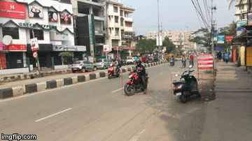

# Object-Detection-through-SSD

# About
A Pytorch implementation of Single Shot Multi-Box Detector.I implemented on a video that I took on a street.

# Requirements
1. You can install Spider or any IDE of your choice.
2. Install Pytorch
3. Download the pre-trained SSD network for detection

link : https://drive.google.com/open?id=18NEJeZy6zXdbk4veEJmOCuCfjPI8hw0z

# Implimentation
Save the repo. Change the ('ghystreet2.mp4')  in object_detect.py to any video of your choice. and run the file object_detect.py 

# Output

